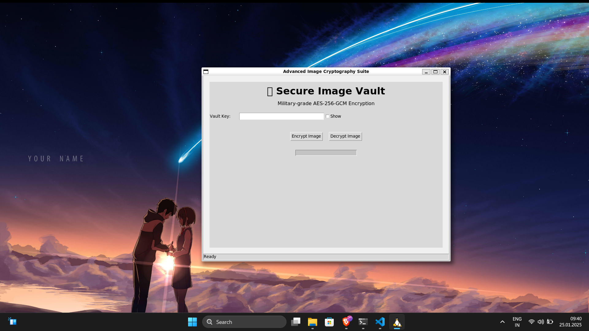
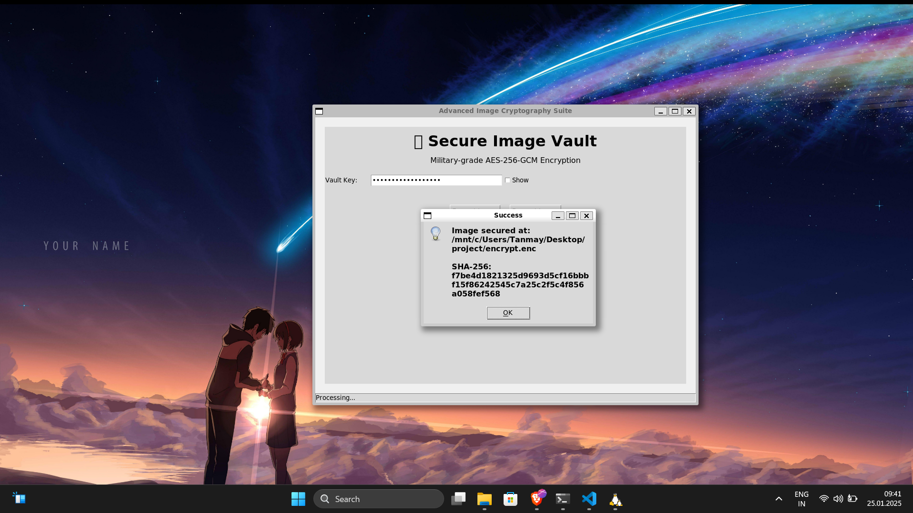
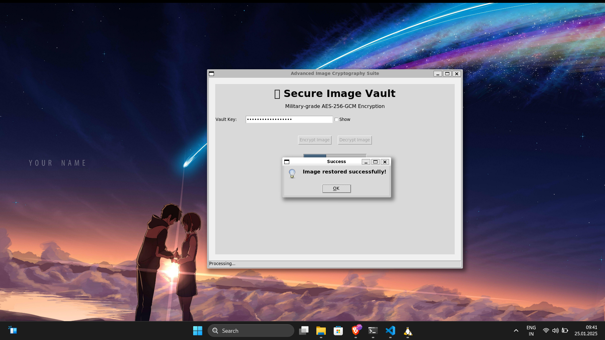

SecureImageTool 🔒

**SecureImageTool** is an advanced, cross-platform application for encrypting and decrypting images using state-of-the-art cryptographic techniques. Built with Python and Tkinter, it provides a user-friendly interface for securing sensitive image files with military-grade encryption.

---

## Features ✨

### **Advanced Security**
- **AES-256-GCM Encryption**: Authenticated encryption ensures both confidentiality and integrity.
- **Scrypt Key Derivation**: Memory-hard key derivation function to resist brute-force attacks.
- **Secure Metadata Handling**: Preserves image metadata (format, mode) while encrypting.
- **Password Strength Meter**: Real-time feedback on password strength.

### **User-Friendly Interface**
- **Cross-Platform Support**: Works on Windows, macOS, and Linux.
- **Modern UI**: Clean and intuitive design with dark/light theme support.
- **Progress Indicators**: Visual feedback during encryption/decryption operations.
- **File Integrity Verification**: SHA-256 hash verification for encrypted files.

### **Robust Error Handling**
- **Input Validation**: Ensures valid passwords and file selections.
- **Comprehensive Error Messages**: Clear feedback for cryptographic failures or corrupted files.
- **Metadata Validation**: Verifies image metadata during decryption to prevent tampering.

---

## Installation 🛠️

### Prerequisites
- Python 3.8 or higher
- `Pillow` (PIL) for image processing
- `cryptography` for cryptographic operations

### Steps
1. Clone the repository:
   ```bash
   git clone https://github.com/tanm-sys/SecureImageTool.git
   cd SecureImageTool
   ```

2. Install dependencies:
   ```bash
   pip install -r requirements.txt
   ```

3. Run the application:
   ```bash
   python image_encrypt_decrypt.py
   ```

---

## Usage 🖼️

### **Encrypting an Image**
1. Launch the application.
2. Enter a strong password in the "Vault Key" field.
3. Click **Encrypt Image**.
4. Select the image file you want to encrypt.
5. Choose a location to save the encrypted file (`.enc` format).

### **Decrypting an Image**
1. Launch the application.
2. Enter the same password used for encryption.
3. Click **Decrypt Image**.
4. Select the encrypted file (`.enc` format).
5. Choose a location to save the decrypted image.

---

## Technical Details 🧠

### **Encryption Process**
1. **Key Derivation**: Uses Scrypt with 1,048,576 iterations to derive a 256-bit key from the password.
2. **Encryption**: Encrypts the image using AES-256-GCM with a 12-byte nonce.
3. **Metadata Preservation**: Stores image metadata (width, height, mode, format) in the encrypted file header.
4. **Authentication**: Includes an authentication tag to verify data integrity.

### **File Format**
Encrypted files have the following structure:
- **Header**: Contains cryptographic parameters (salt, iterations, nonce) and image metadata.
- **Metadata**: Stores image mode and format as UTF-8 encoded strings.
- **Ciphertext**: Encrypted image data with authentication tag.

---

## Screenshots 📸

### Main Interface


### Encryption Success


### Decryption Success


---

## Contributing 🤝

Contributions are welcome! Please follow these steps:
1. Fork the repository.
2. Create a new branch for your feature or bugfix.
3. Submit a pull request with a detailed description of your changes.

---

## License 📜

This project is licensed under the **MIT License**. See the [LICENSE](LICENSE) file for details.

---

## Acknowledgments 🙏

- **Pillow**: For image processing capabilities.
- **cryptography**: For providing secure cryptographic primitives.
- **Tkinter**: For the cross-platform GUI framework.

---

## Support 💬

For questions, issues, or feature requests, please open an issue on the [GitHub repository](https://github.com/tanm-sys/SecureImageTool/issues).

---

**SecureImageTool** is designed to provide robust security for your sensitive images while maintaining ease of use. Protect your digital assets with confidence! 🔒

---
